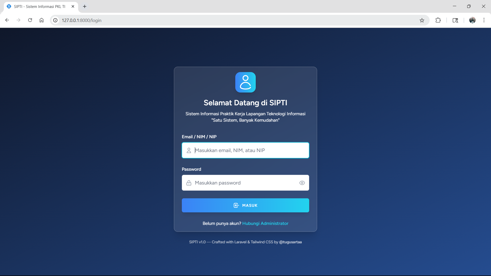
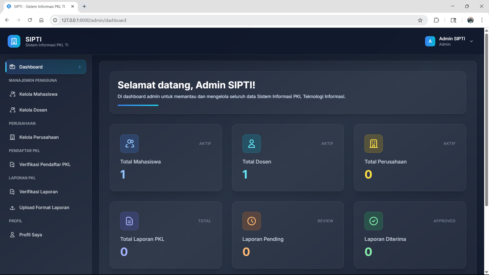
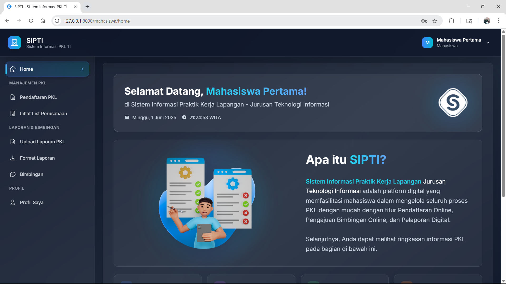

# 🎓 SIPTI - Sistem Informasi PKL TI

**SIPTI** adalah aplikasi web berbasis Laravel untuk mempermudah pengelolaan proses **Praktik Kerja Lapangan (PKL)** di lingkungan **Jurusan Teknologi Informasi**. Sistem ini menyediakan fitur lengkap mulai dari pendaftaran PKL, pengajuan bimbingan, unggah laporan, hingga penilaian akhir oleh dosen pembimbing.

## 📌 Fitur Utama

### 🔐 Otentikasi Role

-   Admin
-   Dosen Pembimbing
-   Mahasiswa

### 🎛️ Admin

-   Dashboard statistik
-   Kelola data mahasiswa dan dosen (manual & import Excel)
-   Kelola perusahaan mitra
-   Verifikasi pendaftaran dan laporan PKL
-   Upload format laporan resmi

### 🧑‍🏫 Dosen

-   Lihat mahasiswa bimbingan
-   Konfirmasi jadwal bimbingan dan lihat jadwal
-   Input nilai PKL (hanya jika mahasiswa minimal 4x bimbingan disetujui)

### 🎓 Mahasiswa

-   Pendaftaran PKL dan pantau status pendaftaran
-   Lihat list perusahaan dan ajukan referensi perusahaan
-   Ajukan bimbingan PKL
-   Unggah laporan PKL
-   Unduh format laporan

## 🚀 Instalasi & Setup

### 1. Clone Repository

```bash
git clone https://github.com/TugusArtaa/SIPTI.git
cd SIPTI
```

### 2. Install Dependency via Composer

```bash
composer install
```

### 3. Install Frontend Dependency (Vite)

```bash
npm install
npm run dev
```

### 4. Duplikat .env

```bash
cp .env.example .env
```

### 5. Generate App Key

```bash
php artisan key:generate
```

### 6. Setup Database

-   Buat database baru di MySQL: sipti_db
-   Sesuaikan konfigurasi .env:

```bash
DB_DATABASE=sipti_db
DB_USERNAME=root
DB_PASSWORD=
```

### 7. Jalankan Migrasi

```bash
php artisan migrate
```

### 8. Buat Storage Link

```bash
php artisan storage:link
```

### 9. Jalankan Aplikasi

```bash
php artisan serve
```

## Tampilan User Interface

### 🖼️ Login



### 🎛️ Admin



### 🎓 Mahasiswa



### 🧑‍🏫 Dosen


## 🧩 Teknologi

-   Laravel 11
-   Laravel Breeze (auth)
-   Tailwind CSS
-   Vite
-   MySQL
