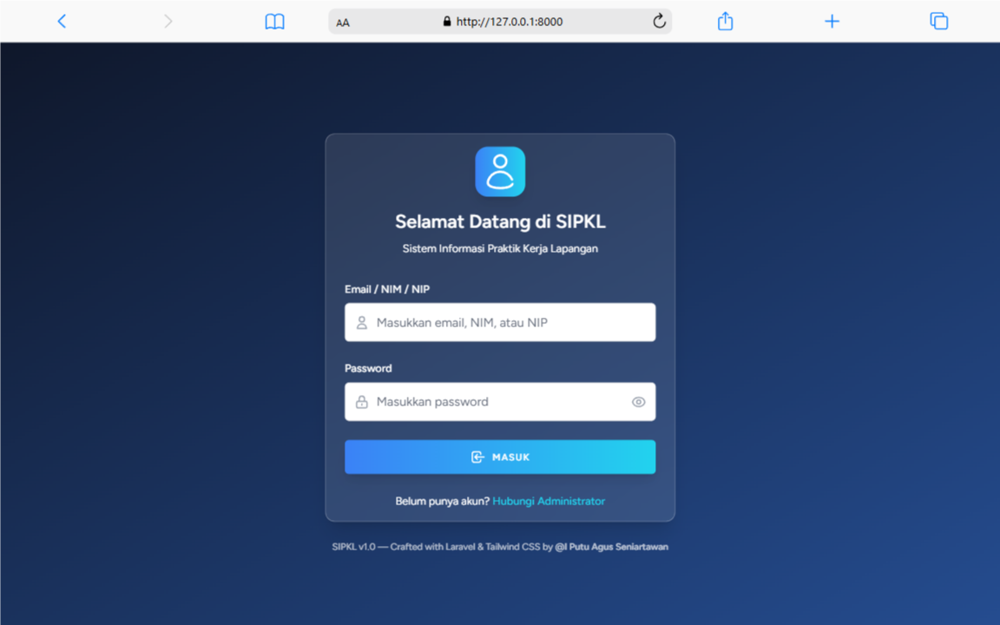

# 🎓 SIPKL (Sistem Informasi Praktik Kerja Lapangan)

**SIPKL** adalah aplikasi web berbasis Laravel untuk mempermudah pengelolaan proses **Praktik Kerja Lapangan (PKL)** di lingkungan **Jurusan Kampus**. Sistem ini menyediakan fitur lengkap mulai dari pendaftaran PKL, pengajuan bimbingan, unggah laporan, hingga penilaian akhir oleh dosen pembimbing.

## 📌 Fitur Utama

### 🔐 Otentikasi Role

-   Admin
-   Dosen Pembimbing
-   Mahasiswa

### 🎛️ Admin

-   Dashboard statistik
-   Kelola data mahasiswa dan dosen (manual & import Excel)
-   Kelola perusahaan mitra
-   Verifikasi pendaftaran dan laporan PKL
-   Upload format laporan resmi

### 🧑‍🏫 Dosen

-   Lihat mahasiswa bimbingan
-   Konfirmasi jadwal bimbingan dan lihat jadwal
-   Input nilai PKL (hanya jika mahasiswa minimal 4x bimbingan disetujui)

### 🎓 Mahasiswa

-   Pendaftaran PKL dan pantau status pendaftaran
-   Lihat list perusahaan dan ajukan referensi perusahaan
-   Ajukan bimbingan PKL
-   Unggah laporan PKL
-   Unduh format laporan

## 🧩 Teknologi

-   Laravel 11
-   Laravel Breeze (auth)
-   Tailwind CSS
-   Vite
-   MySQL

## Tampilan User Interface

<table>
  <tr>
    <td></td>
    <td></td>
  </tr>
  <tr>
    <td></td>
    <td></td>
  </tr>
  <tr>
    <td></td>
    <td></td>
  </tr>
  <tr>
    <td></td>
    <td></td>
  </tr>
  <tr>
    <td></td>
    <td></td>
  </tr>
  <tr>
    <td></td>
    <td></td>
  </tr>
  <tr>
    <td></td>
    <td></td>
  </tr>
  <tr>
    <td></td>
    <td></td>
  </tr>
  <tr>
    <td></td>
    <td></td>
  </tr>
</table>
